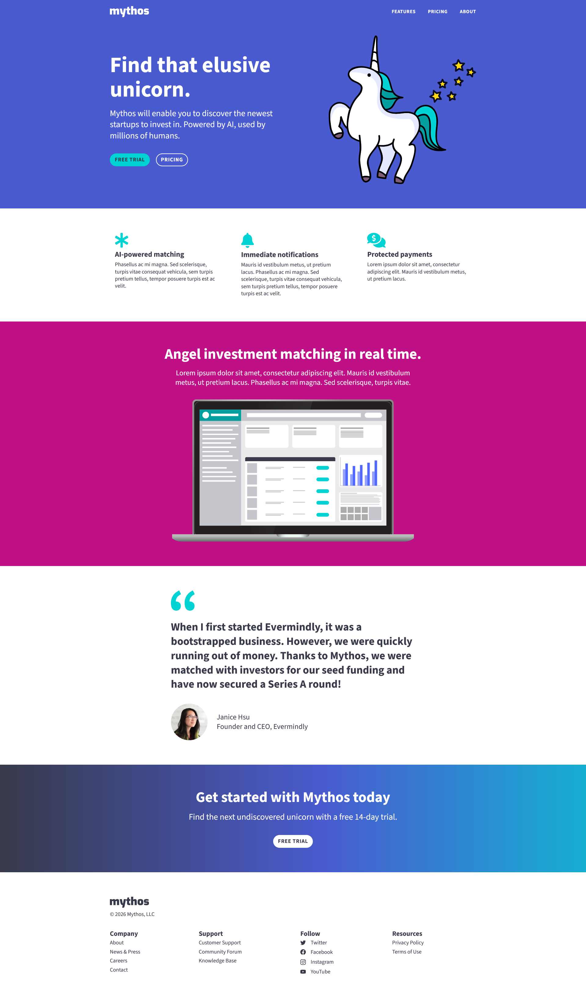
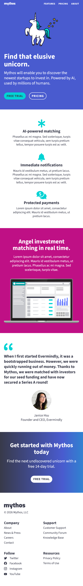

# Mythos — Responsive Website

## Project overview

A static, responsive marketing site for a fictional product called **Mythos**. Built with semantic HTML and organized assets. Focuses on clarity, accessibility, and responsive layout for desktop and mobile.

## Features

- Hero section with illustration and primary call-to-action buttons.
- Feature grid describing core product capabilities.
- Full-width informational section with imagery (dashboard).
- Testimonial block with quote and author.
- Footer with company links, social icons (SVG), and legal resources.
- Accessibility-minded elements: skip link, semantic headings, descriptive `alt` attributes, responsive `srcset` usage for author image.

## Tech stack

- HTML5
- Static assets (SVG, PNG, JPG)
- Intended CSS (linked as `/style.css`)
- Optional static server for local development (no build step required)

## Accessibility checklist

- Keep the "Skip to main content" link visible to keyboard users (not visually hidden from assistive tech).
- Provide meaningful `alt` text for decorative icons as empty (`alt=""`) or descriptive where informative.
- Maintain logical heading order (`h1`, then `h2` sections).
- Ensure color contrast in CSS meets WCAG AA for body text and UI controls.
- Make interactive elements keyboard-focusable and include visible focus styles.

## Responsive guidance

- Use a fluid grid for `.wrapper` and media queries for breakpoints (mobile-first).
- Stack feature items vertically on narrow screens.
- Make hero image scale with `max-width: 100%` and maintain aspect ratio.

## Screenshots

